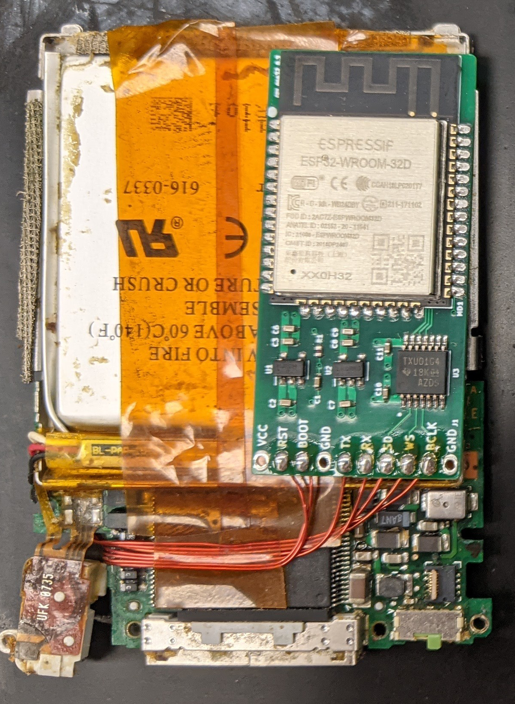

# Installing the iPod Board
This is not an easy soldering job by any stretch of the imagination. You will need a steady hand and a lot of patience. If you're not comfortable with this level of soldering (like me), then I would recommend taking it to a friend who is (like I did - Thanks, Wesley!).

## Soldering

> **Note**
> You don't have to do it this way if you don't want to. If you want to get the signals in some better less fragile way, go for it. Also please let me know about it because I'd love to see it.

Have several prepared lengths of wire ready to go. Pick a gauge of wire that fits on the pins and you feel comfortable working with.

The iPod board is a very small board with a lot of components on it. You will need to solder to the following places on the board:

You may have to zoom in on the 30 pin and the DAC chip. (base image from [freemyipod.org](https://freemyipod.org/wiki/Nano_3G))

You're basically soldering to the _side_ of the DAC chip. It's not very fun. But you only need to do it thrice. The next four on the 30-pin connector are for programming in-circuit and control of the iPod over Serial. The last two connect the iPod's battery to the Bluetooth board. Careful with these to ensure they don't short.

Next, you'll probably want to epoxy the joints. Any well mixed and good epoxy will work here. The primary concern is whether or not the epoxy shrinks while it cures. UV glue seemed to shrink a bit while curing which put unnecessary tension on the joints. That's why I used epoxy. Apply it with a toothpick or something similar. You don't want to build the epoxy so high that it won't fit back in the front plate upon reassembly.

In the end, you should have soldered 9 places:
 1. Word Select on the DAC (`WS`)
 1. Data Out on the DAC (`DOUT` or `SD`)
 1. Bit Clock on the DAC (`BCLK`)
 1. `TX` on the 30-pin connector
 1. `RX` on the 30-pin connector
 1. `BOOT` on the 30-pin connector
 1. `RTS` on the 30-pin connector

The hard part is done! Next, attach these wires them to the Bluetooth board. The pinout is printed on the board. You can get a hint of how to route it in the image below:

(Not pictured: the battery connections to the Bluetooth board. Attach them to VCC and GND.)

The `TX -> RX` connection goes to `RX `on the Bluetooth board. The `RX -> TX` connection goes to TX on the Bluetooth board. `DOUT` goes to `SD` on the board. The rest should be self-explanatory.

## Testing

A good way to test this is to make sure you see the relevant signals on the I2S lines is to start playing music and poke the solder joints on the Bluetooth board with an oscilloscope. You should see the signals on the lines. If you don't, you probably have a bad solder joint. If you do, you're good to go!

If you try to play music and the time doesn't advance past 0:00, you probably have a bad solder joint that's shorting to another data line.

You can test the serial connection by connecting the iPod to your computer through a 3.3v FTDI or similar and trying to send control bytes to it while it's on. I've included a small Ruby script that defines the control bytes and how to send the correctly formed packet. You can also look at the [Board Firmware](../board-firmware/board-firmware.ino) for an example of how to send the packets. You can also just check the continuity of these lines with a multimeter if that's more your speed.

With a multimeter, you can check to make sure the iPod's battery has 3.7v on it. If it doesn't, the battery might be dead. Like I did in the video, you might need to jump it with a 3.7v power source to get it to boot.
